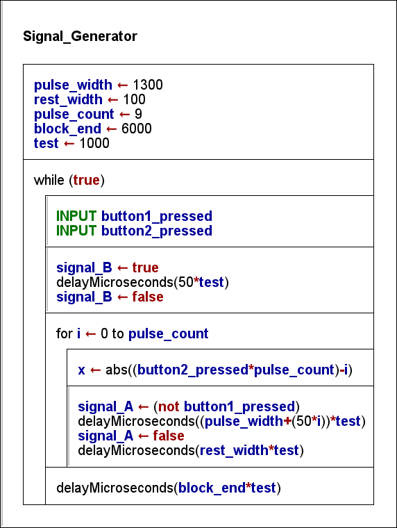

### B31DG_AS1_jbm5
# B31DG: Embedded Software
# Assignment 1
###### Jack B. Mavor
###### H00298763

## [Main .ino File](/em_as1_jbm5/em_as1_jbm5.ino)
This repository was created to work with my VSCode environment and workflow, to this end there are files within this repository that are meant to setup and maintain that environment. The only file required to run the project is the file "em_as1_jbm1.ino", all other files are either part of the VSCode workflow, or other documents related to the project.

## Tasks
- [x] Write a program for ESP32 boared producing an output signals specified
    - [x] Create Nassi-Shneiderman diagram
    - [x] Write code based on the Nassi-Shneiderman diagram
    - [x] Ensure readibility of code
    - [x] Thourghly comment code
- [ ] Demonstration
    - [ ] Demonstraite the code during a lab session
    - [ ] Show commit history
- [x] Submission
    - [x] Submit source files
    - [x] Submit Nassi-Shneiderman diagram
    - [x] Submit revision history

## Calculating Initial Parameters
|Letter|Letter|Number|
|:---:|:---:|:---:|
|A|Z|1|
|N|Y|2|
|C|X|3|
|D|W|4|
|E|V|5|
|F|U|6|
|G|T|7|
|H|S|8|
|I|R|9|
|J|Q|10|
|K|P|11|
|L|O|12|
|M|N|13|

|Parameter|Description|Letter|Value|
|:---:|:---:|:---:|:---:|
|a|width of 1st pulse|M|1300 μs|
|b|width of space between pulses|A|100 μs|
|c|number of pulses per block|V|9|
|d|space between pulse blocks|O|6000 μs|
|mode|secondary system mode|R|2|

|Mode|Effect|
|:---:|:---:|
|~~1~~|~~Remove 3 pulses from pulse block (i.e. c-3 pulses in block) until switch 2 set back to 0.~~|
|**2**|**Generate inverted form of complete Sig A waveform (from the largest pulse to the shortest) until switch 2 set back to 0**|
|~~3~~|~~insert an extra 3 pulses into pulse block (i.e. c+3 pulses in block) until switch set back to 0~~|
|~~4~~|~~Half d and b time until switch set back to 0~~|

## N-S Diagram

